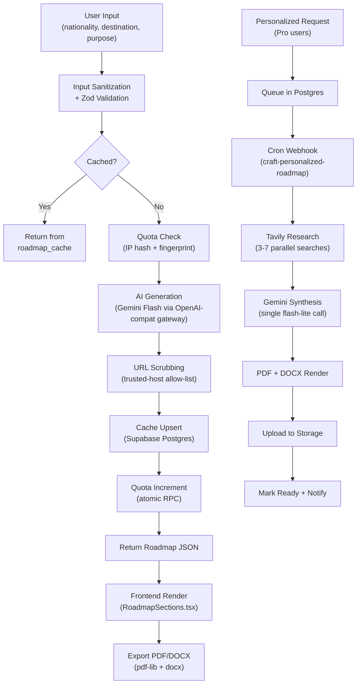
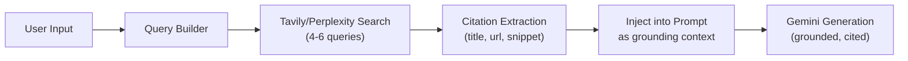
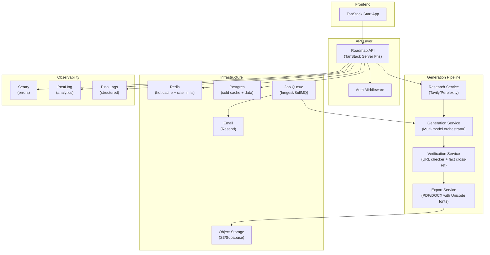

# VisaClarity v1.0 — Roadmap Generation Architecture Audit

> **Scope**: Full-stack audit of the roadmap generation pipeline — input handling, AI generation, post-processing, caching, export, personalized roadmaps, front-end rendering, and system design.
>
> **Date**: June 8, 2026

---

## Table of Contents

1. [Architecture Overview](#1-architecture-overview)
2. [Current Data Flow](#2-current-data-flow)
3. [What's Working Well](#3-whats-working-well)
4. [Critical Issues Downgrading Output Quality](#4-critical-issues-downgrading-output-quality)
5. [Moderate Issues Limiting Quality](#5-moderate-issues-limiting-quality)
6. [Minor Issues & Polish](#6-minor-issues--polish)
7. [Technical Upgrades to Improve Quality](#7-technical-upgrades-to-improve-quality)
8. [Backend Features, Libraries & Algorithms](#8-backend-features-libraries--algorithms)
9. [System Design Improvements](#9-system-design-improvements)
10. [Prioritized Roadmap](#10-prioritized-roadmap)

---

## 1. Architecture Overview



### File Map

| Layer                      | Files                                                                                                                                                                              | Purpose                           |
| -------------------------- | ---------------------------------------------------------------------------------------------------------------------------------------------------------------------------------- | --------------------------------- |
| **Input & Routing**        | [roadmap.tsx](file:///d:/Visa Clarity/src/routes/roadmap.tsx), [r.$slug.tsx](file:///d:/Visa Clarity/src/routes/r.$slug.tsx)                                                       | Front-end pages                   |
| **Core Generation**        | [roadmap.functions.ts](file:///d:/Visa Clarity/src/lib/roadmap.functions.ts)                                                                                                       | Standard roadmap (free + deep)    |
| **AI Gateway**             | [ai-gateway.server.ts](file:///d:/Visa Clarity/src/lib/ai-gateway.server.ts)                                                                                                       | Single-point AI routing           |
| **Personalized Research**  | [personalized-roadmap-research.server.ts](file:///d:/Visa Clarity/src/lib/personalized-roadmap-research.server.ts)                                                                 | Tavily web search                 |
| **Personalized Craft**     | [personalized-roadmap-craft.server.ts](file:///d:/Visa Clarity/src/lib/personalized-roadmap-craft.server.ts)                                                                       | Synthesis prompt + schema         |
| **Personalized Functions** | [personalized-roadmap.functions.ts](file:///d:/Visa Clarity/src/lib/personalized-roadmap.functions.ts)                                                                             | Queue management CRUD             |
| **Webhook Worker**         | [craft-personalized-roadmap.ts](file:///d:/Visa Clarity/src/routes/api/public/hooks/craft-personalized-roadmap.ts)                                                                 | Cron-triggered batch processor    |
| **Export**                 | [roadmap-export.server.ts](file:///d:/Visa Clarity/src/lib/roadmap-export.server.ts)                                                                                               | PDF (pdf-lib) + DOCX (docx)       |
| **Export Functions**       | [roadmap-export.functions.ts](file:///d:/Visa Clarity/src/lib/roadmap-export.functions.ts)                                                                                         | Server FN wrappers                |
| **Saga**                   | [saga.server.ts](file:///d:/Visa Clarity/src/lib/saga.server.ts)                                                                                                                   | Compensation-based distributed tx |
| **Idempotency**            | [idempotency.server.ts](file:///d:/Visa Clarity/src/lib/idempotency.server.ts)                                                                                                     | Dedup for non-idempotent ops      |
| **Storage**                | [storage.server.ts](file:///d:/Visa Clarity/src/lib/storage.server.ts)                                                                                                             | Pluggable Supabase / S3 backend   |
| **Entitlements**           | [entitlements.server.ts](file:///d:/Visa Clarity/src/lib/entitlements.server.ts)                                                                                                   | Tier gating                       |
| **Frontend**               | [RoadmapSections.tsx](file:///d:/Visa Clarity/src/components/roadmap/RoadmapSections.tsx), [RoadmapActions.tsx](file:///d:/Visa Clarity/src/components/roadmap/RoadmapActions.tsx) | UI rendering                      |

---

## 2. Current Data Flow

### Standard Roadmap (Free + Pro Deep)

```
1. User submits (nationality, destination, purpose) → roadmap.tsx
2. sanitizeField() strips non-alpha chars, caps length
3. getRequestTier() → decides standard vs deep model + token budget
4. Cache lookup (cache_key = "nat|dest|purpose|s/d")
5. If miss → quota check (dual IP-hash + fingerprint, 1/month free)
6. Build prompt → callLovableAI() via ai-gateway.server.ts
   - Model: gemini-2.5-flash-lite (free) / gemini-2.5-flash (pro)
   - Max tokens: 4096 (free) / 8192 (pro)
   - Temperature: 0.3
   - Response: json_schema (strict mode)
7. RoadmapSchema.parse() → Zod validation
8. scrubUrls() → drop untrusted-domain URLs
9. Upsert roadmap_cache (14-day TTL)
10. Increment usage counters
11. Return enriched Roadmap object
```

### Personalized Roadmap (Pro only)

```
1. User fills PersonalizedRoadmapForm → createPersonalizedRoadmapRequest()
2. Insert into personalized_roadmap_requests (status: "queued")
3. External cron hits POST /api/public/hooks/craft-personalized-roadmap
4. Worker claims row (optimistic lock via status=queued WHERE)
5. researchPersonalizedRoadmap() → 3-7 Tavily searches in parallel
6. craftPersonalizedRoadmap() → single Gemini flash-lite call
7. generateRoadmapPdf() + generateRoadmapDocx()
8. Upload to personalized-roadmaps bucket
9. Mark row as "ready"
```

---

## 3. What's Working Well

| Aspect                   | Details                                                                              |
| ------------------------ | ------------------------------------------------------------------------------------ |
| ✅ **Structured Output** | JSON schema strict mode eliminates parse failures — the model is forced to conform   |
| ✅ **URL Trust Filter**  | `TRUSTED_HOST_SUFFIXES` + regex for `.gov` TLDs effectively blocks hallucinated URLs |
| ✅ **Tiered Models**     | Free ≠ Pro: separate models, token budgets, and prompts — good cost/quality tradeoff |
| ✅ **Cache Layer**       | 14-day TTL prevents redundant AI calls for identical routes                          |
| ✅ **Dual Quota**        | IP hash + device fingerprint makes free-tier abuse harder                            |
| ✅ **Saga Pattern**      | Compensation-based rollback for the multi-system personalized flow is well-designed  |
| ✅ **Idempotency**       | Prevents duplicate request creation on retries                                       |
| ✅ **Portable Storage**  | Supabase → S3 switchable via env vars alone                                          |
| ✅ **AI Gateway Seam**   | One function to swap providers — good abstraction                                    |
| ✅ **Export Quality**    | PDF has premium header, gold accents, checkbox pre-flight checklist                  |
| ✅ **Progress Tracking** | Local-storage checkbox state per roadmap — nice UX touch                             |
| ✅ **Share Slugs**       | `/r/$slug` for shareable read-only links                                             |

---

## 4. Critical Issues Downgrading Output Quality

### 4.1 🔴 No Real-Time Data — AI Relies 100% on Training Knowledge

**File**: [roadmap.functions.ts:587-592](file:///d:/Visa Clarity/src/lib/roadmap.functions.ts#L587-L592)

The standard roadmap prompt says "Use 2026 figures" but the model has **no access to live data**. Gemini's training cutoff means:

- Visa fees may be outdated or wrong
- Processing times are hallucinated averages
- Embassy contact details (phone, email, address) are frequently stale
- Official portal URLs change regularly (VFS Global, TLS, etc.)

**Impact**: This is the #1 quality killer. Users trust the output as current, but it may be months behind.

**Fix**: Add a **Retrieval-Augmented Generation (RAG)** layer before the standard roadmap call (like you already do for personalized). Run 3-5 Tavily/Perplexity searches, inject results into the prompt.

---

### 4.2 🔴 No Link Verification — "Verified" Badge is Misleading

**File**: [RoadmapSections.tsx:710-748](file:///d:/Visa Clarity/src/components/roadmap/RoadmapSections.tsx#L710-L748)

The UI shows a ✓ "Verified official source" badge next to every source URL. But:

- URLs are only **domain-checked** (is it `.gov`?) — never **HTTP-verified**
- `brokenLinks` is always returned as `[]` (hardcoded empty array)
- The model regularly returns `.gov` URLs that are valid domains but **wrong paths** (404s)

```typescript
// roadmap.functions.ts line 640-646
return {
  roadmap: {
    ...generated,
    verifiedAt,
    cached: false,
    brokenLinks: [], // ← Always empty. Never actually checked.
    shareSlug,
  },
};
```

**Impact**: Users click "verified" links → get 404s → lose trust instantly.

**Fix**: Add async HEAD-request verification for all URLs in the scrubbing phase. Flag broken ones in `brokenLinks` and show a different badge.

---

### 4.3 🔴 Personalized Roadmap Uses Cheapest Model

**File**: [personalized-roadmap-craft.server.ts:195](file:///d:/Visa Clarity/src/lib/personalized-roadmap-craft.server.ts#L195)

```typescript
model: "google/gemini-2.5-flash-lite",  // "Cheapest capable model"
```

This is a **paying customer's premium personalized roadmap** — yet it uses the cheapest model (`flash-lite`). The standard Pro roadmap already uses `gemini-2.5-flash`. The personalized one should use an **equal or better** model since it's the premium feature.

**Impact**: Personalized roadmaps may be worse quality than standard Pro roadmaps, which is backwards for a premium feature.

**Fix**: Use `gemini-2.5-flash` minimum, or better yet `gemini-2.5-pro` for personalized.

---

### 4.4 🔴 Standard Free Roadmap is Too Thin (4096 tokens)

**File**: [roadmap.functions.ts:14](file:///d:/Visa Clarity/src/lib/roadmap.functions.ts#L14)

```typescript
const AI_MAX_OUTPUT_TOKENS_STANDARD = 4096;
```

4096 tokens for a comprehensive roadmap with 15 sections is very tight. The model is forced to:

- Truncate action items to 2-3 per step instead of 5
- Write minimal document descriptions
- Skip financial details
- Produce generic pro tips

This makes the free tier look low-quality, which hurts conversion to Pro.

**Impact**: Free users see a thin, shallow roadmap and don't realize Pro is significantly better — they just think the product is mediocre.

**Fix**: Increase to 6144 tokens for free tier. The marginal cost is pennies with flash-lite.

---

### 4.5 🔴 Personalized Craft Schema is Missing Key Sections

**File**: [personalized-roadmap-craft.server.ts:61-140](file:///d:/Visa Clarity/src/lib/personalized-roadmap-craft.server.ts#L61-L140)

The personalized `RESPONSE_SCHEMA` is **missing** these fields that the standard schema has:

- `appointmentBooking` (label, url, note)
- `biometrics` (required, where, cost, note)
- `interview` (required, typicalQuestions, tips)
- `embassyContacts` (name, city, address, phone, email, website)
- `officialLinks` (title, url, purpose)
- `usefulResources` (title, url, note)

**Impact**: Personalized roadmaps arrive without embassy contacts, appointment booking links, biometrics info, or interview prep — the most valuable sections for users.

**Fix**: Align the personalized schema with the full standard schema. The CraftedRoadmap type should be a superset, not a subset.

---

## 5. Moderate Issues Limiting Quality

### 5.1 🟡 No Multi-Step Reasoning / Chain-of-Thought

The entire roadmap is generated in a **single LLM call**. A single call can't:

- Cross-verify facts between sections
- Research → Plan → Draft → Review
- Ensure step ordering is logically coherent
- Validate that financial amounts add up to the total cost

**Fix**: Implement a **multi-agent pipeline**:

1. **Research Agent** — web search for facts
2. **Planning Agent** — structure the roadmap outline
3. **Drafting Agent** — fill in details
4. **Verification Agent** — cross-check, flag inconsistencies

---

### 5.2 🟡 No Prompt Versioning or A/B Testing

**File**: [roadmap.functions.ts:240-300](file:///d:/Visa Clarity/src/lib/roadmap.functions.ts#L240-L300)

Prompts are hardcoded inline. There's no:

- Version tracking for prompt changes
- A/B testing framework to compare prompt quality
- Rollback mechanism if a prompt change degrades output

**Fix**: Move prompts to database-stored templates with version numbers. Log which prompt version generated each roadmap.

---

### 5.3 🟡 Temperature Too High for Factual Content

**File**: [roadmap.functions.ts:16](file:///d:/Visa Clarity/src/lib/roadmap.functions.ts#L16)

```typescript
const AI_TEMPERATURE = 0.3;
```

For factual, accuracy-critical content like visa requirements, temperature should be **0.1–0.15**. At 0.3, the model has enough creative latitude to:

- Vary fee amounts across regenerations
- Introduce different document requirements for the same route
- Produce inconsistent embassy contact details

**Fix**: Lower to `0.1` for standard, `0.15` for personalized.

---

### 5.4 🟡 No Feedback Loop / Quality Scoring

There's no mechanism to:

- Rate roadmap quality after viewing
- Track which routes produce poor results
- Feed corrections back into the system
- Monitor hallucination rates per route

**Fix**: Add a simple 👍/👎 feedback button. Store ratings per cache_key. Use low-rated entries to build a "problem routes" watchlist.

---

### 5.5 🟡 Personalized Worker is Stateless Cron (Fragile)

**File**: [craft-personalized-roadmap.ts:148-202](file:///d:/Visa Clarity/src/routes/api/public/hooks/craft-personalized-roadmap.ts#L148-L202)

The personalized worker is a **cron-triggered HTTP endpoint** with `MAX_PER_TICK = 2`. Issues:

- If the cron fires every minute, max throughput = 2 jobs/min
- No backpressure — 100 queued jobs = 50 minutes wait
- Worker timeout may kill mid-processing jobs
- No parallel workers — single sequential processing

**Impact**: Users see "10–15 minutes" but during peak load it could be hours.

**Fix**: Use a proper job queue (BullMQ / Inngest / Temporal) with configurable concurrency and dead-letter queues.

---

### 5.6 🟡 No Email Notification Implemented

**File**: [craft-personalized-roadmap.ts:126](file:///d:/Visa Clarity/src/routes/api/public/hooks/craft-personalized-roadmap.ts#L126)

```typescript
notified_at: new Date().toISOString(),  // ← Sets timestamp but sends NO email
```

The `notify_email` field is collected and stored, but the worker never actually sends an email. It just marks `notified_at`.

**Impact**: Users wait for an email that never arrives. They have to manually check the dashboard.

**Fix**: Integrate Resend/Postmark/SendGrid to send a notification email when status → "ready".

---

### 5.7 🟡 Cache Invalidation is Purely Time-Based

Cache TTL is 14 days. But visa rules can change overnight (new fees, policy changes, suspended services). There's no:

- Manual cache bust for specific routes
- Admin panel to invalidate stale entries
- Auto-invalidation based on external triggers

**Fix**: Add an admin endpoint to invalidate cache by route. Consider reducing TTL to 7 days.

---

### 5.8 🟡 Sanitization Strips Non-Latin Characters

**File**: [roadmap.functions.ts:62-67](file:///d:/Visa Clarity/src/lib/roadmap.functions.ts#L62-L67)

```typescript
function sanitizeField(s: string): string {
  return s
    .replace(/[^A-Za-z\s\-]/g, "")
    .trim()
    .slice(0, MAX_FIELD_LEN);
}
```

This strips **all non-ASCII characters**. Countries like "Côte d'Ivoire", "São Tomé", "Curaçao" become "Cte dIvoire", "So Tom", "Curaao".

**Impact**: Breaks or degrades roadmaps for ~30+ countries/territories with accented names.

**Fix**: Allow Unicode letters: `s.replace(/[^\p{L}\s\-']/gu, "")`.

---

## 6. Minor Issues & Polish

### 6.1 🟢 PDF Export Uses Only Built-in Fonts

**File**: [roadmap-export.server.ts:62-63](file:///d:/Visa Clarity/src/lib/roadmap-export.server.ts#L62-L63)

```typescript
const font = await pdf.embedFont(StandardFonts.Helvetica);
const bold = await pdf.embedFont(StandardFonts.HelveticaBold);
```

Standard Helvetica doesn't support Unicode. The `toWinAnsi()` function replaces arrows, bullets, and special chars with ASCII approximations. This means:

- "→" becomes "->"
- "•" becomes "-"
- Non-Latin names become "?"

**Fix**: Embed a custom Unicode font (Inter, Noto Sans) via `pdf-lib`'s `embedFont(fontBytes)`.

---

### 6.2 🟢 Front-end Transfers Full Roadmap JSON as Base64

**File**: [roadmap-export.functions.ts:52-60](file:///d:/Visa Clarity/src/lib/roadmap-export.functions.ts#L52-L60)

The export returns the entire PDF/DOCX as a base64 string in the JSON response. For a 10-page PDF, that's ~200KB of base64 through the JSON pipe. This is inefficient but works.

**Fix** (when scaling): Generate server-side, upload to storage, return a signed URL instead.

---

### 6.3 🟢 No Structured Logging

Errors use `console.error` and `console.warn` — no structured log format, no correlation IDs, no log levels for filtering.

**Fix**: Use Pino or Winston with JSON structured logging. Add `requestId` correlation.

---

### 6.4 🟢 Hardcoded Admin Check

**File**: [roadmap.functions.ts:75-89](file:///d:/Visa Clarity/src/lib/roadmap.functions.ts#L75-L89)

Admin detection re-parses the auth header and hits the DB on every roadmap request (for quota bypass). The same token is parsed twice — once for tier, once for admin.

**Fix**: Combine `isAdminRequest()` and `getRequestTier()` into a single auth-resolver.

---

### 6.5 🟢 Saga Module is Defined but Not Used in the Craft Worker

**File**: [saga.server.ts](file:///d:/Visa Clarity/src/lib/saga.server.ts) vs [craft-personalized-roadmap.ts](file:///d:/Visa Clarity/src/routes/api/public/hooks/craft-personalized-roadmap.ts)

The saga pattern is beautifully implemented but the actual craft worker **doesn't use it**. The worker does manual try/catch with inline error handling instead of saga steps.

**Impact**: If the PDF upload fails after AI generation, there's no cleanup of the AI credits spent.

**Fix**: Wrap the worker's research → craft → render → upload pipeline in `runSaga()`.

---

## 7. Technical Upgrades to Improve Quality

### 7.1 RAG Pipeline (Retrieval-Augmented Generation)

> **Priority: P0 — Highest impact on output quality**



**Implementation**:

- Port the existing `researchPersonalizedRoadmap()` logic to **also serve the standard roadmap**
- For free tier: 3 searches (visa requirements, embassy, fees)
- For Pro: 5-7 searches (add insurance, accommodation, blocked account, e-visa)
- Inject research snippets as `GROUNDING CITATIONS` section in the prompt
- Tell the model: "Use ONLY these URLs in your sources array"

**Libraries**: Tavily SDK (`tavily`), or Perplexity API, or Google Search API + SerpAPI

---

### 7.2 Async Link Verification

> **Priority: P0 — Eliminates the #1 trust-killer**

```typescript
async function verifyUrls(urls: string[]): Promise<Map<string, boolean>> {
  const results = new Map<string, boolean>();
  const checks = urls.map(async (url) => {
    try {
      const res = await fetch(url, { method: "HEAD", signal: AbortSignal.timeout(5000) });
      results.set(url, res.ok || res.status === 301 || res.status === 302);
    } catch {
      results.set(url, false);
    }
  });
  await Promise.allSettled(checks);
  return results;
}
```

**When to run**: After `scrubUrls()`, before cache upsert. Store `brokenLinks` with the actual broken URLs.

---

### 7.3 Multi-Model Orchestration

> **Priority: P1**

Instead of one call, use specialized models for different stages:

| Stage     | Model               | Purpose                                 |
| --------- | ------------------- | --------------------------------------- |
| Research  | Tavily + Perplexity | Live data retrieval                     |
| Structure | Gemini Flash        | Plan the roadmap skeleton               |
| Detail    | Gemini Pro / Claude | Fill rich, accurate details             |
| Verify    | Gemini Flash        | Cross-check facts, flag inconsistencies |

---

### 7.4 Streaming Response

> **Priority: P1 — UX improvement**

Currently the user stares at a fake progress bar for 10-25 seconds. With streaming:

- Use `response_format: "json_schema"` with streaming enabled
- Parse partial JSON as it arrives
- Render sections progressively (overview first, then steps, then documents...)

**Library**: `ai` SDK (already in `package.json`!) has `streamObject()` for structured streaming.

---

### 7.5 Confidence Scoring

> **Priority: P2**

Add a confidence field to each section:

```typescript
steps: z.array(
  z.object({
    order: z.number(),
    title: z.string(),
    confidence: z.enum(["high", "medium", "low"]).optional(),
    // ...
  }),
);
```

Tell the model: "Rate your confidence for each fact. Mark 'low' if based on general knowledge rather than specific sources."

Show in UI with visual indicators (green/yellow/red dots).

---

## 8. Backend Features, Libraries & Algorithms

### 8.1 Recommended Library Stack

| Category          | Current                             | Recommended Upgrade                              | Why                                                          |
| ----------------- | ----------------------------------- | ------------------------------------------------ | ------------------------------------------------------------ |
| **AI SDK**        | Raw fetch to OpenAI-compat endpoint | `ai` SDK (`vercel/ai`) or `@google/genai`        | Built-in streaming, structured output, retry, token counting |
| **Web Search**    | Tavily (personalized only)          | Tavily + Perplexity + Google Search API          | Redundancy + better coverage                                 |
| **PDF Export**    | `pdf-lib` (Helvetica only)          | `@react-pdf/renderer` or `pdfkit` + custom fonts | Unicode support, richer layouts, images                      |
| **Job Queue**     | Cron + Postgres polling             | Inngest / BullMQ / Temporal                      | Proper backpressure, retries, dead-letter, monitoring        |
| **Email**         | None (not implemented)              | Resend / Postmark                                | Transactional email for notifications                        |
| **Logging**       | `console.log`                       | Pino + `pino-pretty` (dev)                       | Structured JSON logs, correlation IDs                        |
| **Monitoring**    | None                                | Sentry (errors) + PostHog (analytics)            | Error tracking, user journey analytics                       |
| **Caching**       | Supabase Postgres                   | Redis (Upstash) for hot cache + Postgres cold    | Sub-5ms cache reads vs ~50ms Postgres                        |
| **Rate Limiting** | Custom (Postgres-based)             | `@upstash/ratelimit` + Redis                     | Sliding window, global distributed limits                    |

---

### 8.2 Algorithms to Add

#### A. Semantic Deduplication

Current caching is exact-match (`nationality|destination|purpose`). But "India" vs "indian" vs "Indian citizen" are different cache keys.

```typescript
function normalizeCacheInput(s: string): string {
  return s
    .toLowerCase()
    .replace(/\b(citizen|national|passport holder|from)\b/g, "")
    .replace(/\s+/g, " ")
    .trim();
}
```

#### B. Adaptive Token Budget

Instead of fixed 4096/8192, calculate based on route complexity:

```typescript
function estimateTokenBudget(nationality: string, destination: string, purpose: string): number {
  const isSchengen = SCHENGEN_COUNTRIES.has(destination.toLowerCase());
  const isComplex = ["work", "study", "immigration"].includes(purpose.toLowerCase());
  const base = isComplex ? 6000 : 4000;
  return isSchengen ? base + 2000 : base; // Schengen has more docs
}
```

#### C. Route Difficulty Pre-Classifier

Before calling the main AI, run a fast classifier to determine expected difficulty and adjust the prompt:

```typescript
const KNOWN_HARD_ROUTES = new Map([
  ["india|usa|work", { visaType: "H-1B", notes: "lottery system, employer-sponsored" }],
  [
    "nigeria|uk|study",
    { visaType: "Student visa", notes: "high refusal rate, strong financial proof needed" },
  ],
]);
```

---

### 8.3 Prompt Engineering Improvements

#### Current Issues in Standard Prompt

1. **No few-shot examples** — the model has no reference for expected quality
2. **No negative examples** — doesn't know what BAD output looks like
3. **No route-specific context injection** — same prompt for US H-1B and Thai tourist visa
4. **No grounding data** — says "use 2026 figures" but has no access to them

#### Improved Prompt Structure

```
[SYSTEM]
You are an expert immigration consultant...

[GROUNDING CONTEXT]  ← NEW
Here are verified, current facts from official sources:
{research_citations_injected_here}

[FEW-SHOT EXAMPLE]  ← NEW
Here is an example of excellent output quality for a similar route:
{example_roadmap_json}

[NEGATIVE GUIDANCE]  ← NEW
NEVER do this:
- Return generic embassy addresses like "Embassy of X, Capital City"
- Use placeholder phone numbers
- Cite URLs you've seen in training but can't verify still exist

[USER]
Generate for: {nationality} → {destination} ({purpose})
```

---

## 9. System Design Improvements

### 9.1 Current Architecture (Monolithic)

```
Client → TanStack Start Server → Gemini API
                ↓
        Supabase (Postgres + Storage)
```

### 9.2 Proposed Architecture (Microservice-Ready)



### 9.3 Database Schema Improvements

#### Add Quality Tracking Table

```sql
CREATE TABLE public.roadmap_quality (
  id UUID PRIMARY KEY DEFAULT gen_random_uuid(),
  cache_key TEXT NOT NULL REFERENCES roadmap_cache(cache_key),
  user_id UUID REFERENCES auth.users(id),
  rating SMALLINT CHECK (rating BETWEEN 1 AND 5),
  feedback TEXT,
  broken_links TEXT[],
  prompt_version TEXT NOT NULL,
  model_used TEXT NOT NULL,
  tokens_used INTEGER,
  generation_time_ms INTEGER,
  created_at TIMESTAMPTZ NOT NULL DEFAULT now()
);
```

#### Add Prompt Registry

```sql
CREATE TABLE public.prompt_registry (
  id UUID PRIMARY KEY DEFAULT gen_random_uuid(),
  name TEXT NOT NULL,          -- "standard", "deep", "personalized"
  version INTEGER NOT NULL,
  system_prompt TEXT NOT NULL,
  user_template TEXT NOT NULL,
  is_active BOOLEAN DEFAULT false,
  created_at TIMESTAMPTZ NOT NULL DEFAULT now(),
  UNIQUE(name, version)
);
```

---

## 10. Prioritized Roadmap

### 🔥 Phase 1 — Quick Wins (1-2 weeks)

| #   | Change                                                   | Impact                   | Effort    | Files                                  |
| --- | -------------------------------------------------------- | ------------------------ | --------- | -------------------------------------- |
| 1   | **Lower temperature to 0.1**                             | Better factual accuracy  | 1 line    | `roadmap.functions.ts`                 |
| 2   | **Increase free token budget to 6144**                   | Better free tier quality | 1 line    | `roadmap.functions.ts`                 |
| 3   | **Fix Unicode sanitization**                             | Support 30+ countries    | 1 line    | `roadmap.functions.ts`                 |
| 4   | **Upgrade personalized model to flash (not flash-lite)** | Better premium quality   | 1 line    | `personalized-roadmap-craft.server.ts` |
| 5   | **Align personalized schema with standard**              | Add missing sections     | ~80 lines | `personalized-roadmap-craft.server.ts` |
| 6   | **Combine admin + tier auth calls**                      | Remove duplicate DB hit  | ~30 lines | `roadmap.functions.ts`                 |

---

### ⚡ Phase 2 — Core Quality (2-4 weeks)

| #   | Change                                | Impact                            | Effort     | Files                                                   |
| --- | ------------------------------------- | --------------------------------- | ---------- | ------------------------------------------------------- |
| 7   | **Add RAG layer to standard roadmap** | Live data grounding               | ~200 lines | New: `roadmap-research.server.ts`                       |
| 8   | **Implement URL verification**        | Eliminate broken "verified" links | ~100 lines | `roadmap.functions.ts`, new: `url-verify.server.ts`     |
| 9   | **Add feedback system**               | Quality measurement loop          | ~150 lines | New: `feedback.functions.ts`, migration                 |
| 10  | **Implement email notifications**     | Complete the promised feature     | ~50 lines  | `craft-personalized-roadmap.ts`, new: `email.server.ts` |
| 11  | **Wire up saga to craft worker**      | Proper error compensation         | ~60 lines  | `craft-personalized-roadmap.ts`                         |

---

### 🚀 Phase 3 — Scale & Polish (4-8 weeks)

| #   | Change                                 | Impact                            | Effort     | Files                                       |
| --- | -------------------------------------- | --------------------------------- | ---------- | ------------------------------------------- |
| 12  | **Streaming responses**                | Instant perceived performance     | ~300 lines | `roadmap.functions.ts`, `roadmap.tsx`       |
| 13  | **Unicode PDF fonts**                  | Proper international char support | ~100 lines | `roadmap-export.server.ts`                  |
| 14  | **Replace cron worker with job queue** | Reliable async processing         | ~200 lines | New: `queue.server.ts`                      |
| 15  | **Prompt versioning + A/B testing**    | Systematic prompt improvement     | ~300 lines | New: `prompt-registry.ts`, migration        |
| 16  | **Multi-agent pipeline**               | Research → Plan → Draft → Verify  | ~500 lines | New: `pipeline/` directory                  |
| 17  | **Redis hot cache**                    | Sub-5ms cache reads               | ~100 lines | New: `cache.server.ts`                      |
| 18  | **Structured logging**                 | Debuggability at scale            | ~150 lines | New: `logger.server.ts`, refactor all files |

---

> [!IMPORTANT]
> **Phase 1 changes are trivial** (mostly 1-line tweaks) but will noticeably improve output quality. Start there.

> [!TIP]
> **The single highest-ROI change** is adding RAG (Phase 2, item #7). It transforms roadmaps from "what Gemini memorized during training" to "what official sources say right now." Every other quality issue becomes secondary once the model has current data to work with.

> [!WARNING]
> **The "Verified" badge (issue 4.2)** is actively misleading users and could be a liability concern. Consider removing the badge immediately and only re-adding it once actual HTTP verification is implemented.
