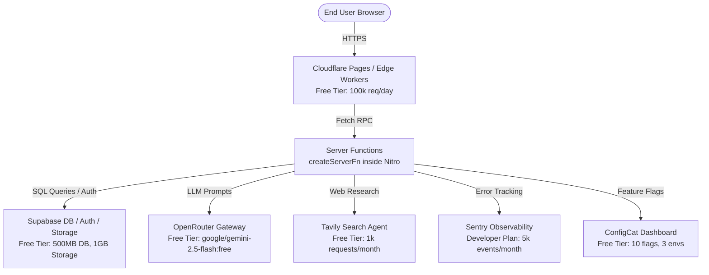

# VisaClarity — Enterprise Migration & DevOps Operations Manual

## (Zero-Cost Infrastructure Blueprint)

This manual serves as the definitive, company-grade operational blueprint for migrating **VisaClarity** off Lovable Cloud, establishing an offline local development workspace, setting up CI/CD automation, and running global production infrastructure on **100% free-tier developer services** (no credit card or paid dependencies required).

---

## 1. System Architecture & Zero-Cost Infrastructure Map

VisaClarity is built on a modern, decoupled stack. The production target is configured for **TanStack Start v1 (React 19) + Tailwind CSS v4 + Supabase**, compiled and served at the edge using **Nitro for Cloudflare Workers**.

### 1.1 Target Architecture & Data Flow

The diagram below illustrates the fully decoupled, zero-cost target topology:



### 1.2 Infrastructure Provider & Cost Breakdown

To satisfy the strict **no-cost** mandate, all services in the pipeline are bound exclusively to permanent developer tiers:

| Provider                     | Purpose                                    | Free Tier Boundaries                                              | Cost      |
| :--------------------------- | :----------------------------------------- | :---------------------------------------------------------------- | :-------- |
| **Cloudflare Pages**         | Application hosting (Static + SSR)         | Unlimited sites, unlimited bandwidth, 100k requests/day           | **$0.00** |
| **Supabase**                 | DB, Auth, Object Storage, RLS              | 500MB Postgres, 1GB Storage, 50k MAUs, 50MB File Limits           | **$0.00** |
| **OpenRouter**               | LLM completion orchestration               | Unlimited requests on `:free` models (e.g. Gemini 2.5 Flash Free) | **$0.00** |
| **Tavily**                   | Search synthesis for personalized roadmaps | 1,000 search requests per month                                   | **$0.00** |
| **Doppler**                  | Secrets mapping & injection                | Developer Plan: Up to 3 users, 3 projects, full history           | **$0.00** |
| **Sentry**                   | Observability, APM, and error tracking     | Developer Plan: 5,000 errors/month, 1 user, full telemetry        | **$0.00** |
| **ConfigCat**                | Live feature flag toggling                 | Free Plan: 10 feature flags, 1 config, 3 environments             | **$0.00** |
| **Cloudflare Web Analytics** | Cookieless, GDPR-compliant tracking        | 100% free, no traffic limitations, zero cookie banners            | **$0.00** |

---

## 2. Phase 1: Local Development Setup & Secure Secrets Injection

### 2.1 Local Prerequisites

Ensure the following tools are installed on the local system:

1. **Node.js (v20+)** or **Bun (v1.1+)**
2. **Docker Desktop** (Required only if running a fully offline Supabase stack)
3. **Supabase CLI** (Required to manage database migrations):
   ```bash
   # Install using npm globally
   npm install -g supabase-cli
   ```
4. **Doppler CLI** (Required to manage and inject secrets securely without local `.env` files):
   - **Windows (Scoop)**: `scoop install doppler`
   - **Windows (Direct)**: Install the binary directly from the official Doppler release pages.

### 2.2 Secure Environment Mapping

To prevent credentials from leaking into repository files, environment variables are managed inside Doppler and injected at runtime.

Copy [`.env.example`](file:///d:/Visa%20Clarity/.env.example) to `.env` for reference. The table below represents the authoritative configuration:

| Variable                        | Scope           | Description / Value                                      |
| :------------------------------ | :-------------- | :------------------------------------------------------- |
| `VITE_SUPABASE_URL`             | Public / Bundle | The API URL of the Supabase project instance             |
| `VITE_SUPABASE_PUBLISHABLE_KEY` | Public / Bundle | Client-safe anonymous API key                            |
| `VITE_SUPABASE_PROJECT_ID`      | Public / Bundle | Unique identifier of the Supabase project                |
| `SUPABASE_URL`                  | Server Only     | Internal/server connection endpoint for Supabase         |
| `SUPABASE_PUBLISHABLE_KEY`      | Server Only     | Server-side backup anonymous key                         |
| `SUPABASE_SERVICE_ROLE_KEY`     | Server Only     | High-privilege access key (Never expose to browser)      |
| `TAVILY_API_KEY`                | Server Only     | API key for web research agent                           |
| `OPENROUTER_API_KEY`            | Server Only     | Authentication key for OpenRouter AI gateway             |
| `AI_GATEWAY_URL`                | Server Only     | Set to `https://openrouter.ai/api/v1/chat/completions`   |
| `AI_GATEWAY_API_KEY`            | Server Only     | OpenRouter API Key (Overrides default `LOVABLE_API_KEY`) |
| `SENTRY_DSN`                    | Server / Bundle | DSN client-endpoint for error reporting                  |
| `CONFIGCAT_SDK_KEY`             | Server Only     | SDK Key for feature flags                                |
| `VITE_SITE_URL`                 | Public / Bundle | Set to canonical domain (e.g., `https://visaclarity.me`) |

### 2.3 Doppler Secret Synchronization Workflow

To run local development with secure, auto-injected secrets:

1. Authenticate the local Doppler CLI:
   ```bash
   doppler login
   ```
2. Setup the project directory mapping:
   ```bash
   doppler setup
   ```
3. Boot the Vite development environment with secrets injected directly into process environment variables:
   ```bash
   doppler run -- npm run dev
   ```

---

## 3. Phase 2: Database Migration & Schema Portability

VisaClarity relies on Postgres relational tables, custom schemas, row-level security (RLS), and database triggers. When migrating, the schema must be fully exported and re-established on the target database.

### 3.1 Target Database Schema Components

The application database comprises 11 primary tables in the `public` schema:

- `blog_posts`: Holds generated SEO blog posts, `qa_score`, `qa_passed`, and `llm_provider`.
- `blog_topic_queue`: Manages the queue of keywords scheduled for sequential post generation.
- `blog_authors`: Contains details on authors publishing blog posts.
- `blog_generation_logs`: Tracks debugging and quality records for LLM runs.
- `error_reports`: Logs client-side and edge-worker errors captured by the error listener.
- `leads`: Captures waitlist signups and contact forms.
- `roadmap_cache`: Stores generated roadmap data indexed by unique shareable slugs.
- `roadmap_usage`: Tracks IP and fingerprint usage limits for the free roadmap tool.
- `saved_roadmaps`: Stores roadmaps created and saved by registered users.
- `user_roles`: Stores administrative user roles.
- `user_subscriptions`: Stores user plan mappings (`free`, `pro`, `pro_max`).

### 3.2 Custom Signup Triggers

The signup triggers automate tier assignment and administrator privileges. Ensure these triggers are created on the target database:

1. **Free Tier Assignment on Signup**:

   ```sql
   CREATE OR REPLACE FUNCTION public.create_free_subscription_on_signup()
   RETURNS trigger AS $$
   BEGIN
     INSERT INTO public.user_subscriptions (user_id, tier)
     VALUES (new.id, 'free');
     RETURN new;
   END;
   $$ LANGUAGE plpgsql SECURITY DEFINER;

   CREATE OR REPLACE TRIGGER on_auth_user_created
     AFTER INSERT ON auth.users
     FOR EACH ROW EXECUTE FUNCTION public.create_free_subscription_on_signup();
   ```

2. **Automatic Admin Grant Trigger**:

   ```sql
   CREATE OR REPLACE FUNCTION public.grant_admin_on_signup()
   RETURNS trigger AS $$
   BEGIN
     IF public.is_admin_email(new.email) THEN
       INSERT INTO public.user_roles (user_id, role)
       VALUES (new.id, 'admin');
     END IF;
     RETURN new;
   END;
   $$ LANGUAGE plpgsql SECURITY DEFINER;

   CREATE OR REPLACE TRIGGER on_admin_signup
     AFTER INSERT ON auth.users
     FOR EACH ROW EXECUTE FUNCTION public.grant_admin_on_signup();
   ```

### 3.3 Relational Database Workers (`pg_cron` & `pg_net`)

VisaClarity schedules its roadmap generation and blog processor using standard Supabase serverless background extensions:

```sql
-- Schedules pg_cron to call the craft personalized roadmap worker every minute
SELECT cron.schedule(
  'process-roadmaps-every-minute',
  '* * * * *',
  $$SELECT net.http_post(
    'https://visaclarity.me/api/public/hooks/craft-personalized-roadmap',
    NULL,
    NULL,
    NULL
  )$$
);
```

### 3.4 Database Export and Import Workflow

To copy the database schema and existing reference metadata, execute the following commands from a terminal containing `psql` and `pg_dump`:

```bash
# 1. Export schema-only framework
pg_dump --no-owner --no-privileges --schema=public --schema-only "$SUPABASE_DB_URL" > schema.sql

# 2. Export table data (excluding system schemas)
pg_dump --no-owner --no-privileges --schema=public --data-only \
  --table=public.error_reports \
  --table=public.leads \
  --table=public.roadmap_cache \
  --table=public.roadmap_usage \
  --table=public.saved_roadmaps \
  --table=public.user_roles \
  --table=public.user_subscriptions \
  --table=public.blog_posts \
  --table=public.blog_authors \
  --table=public.blog_topic_queue \
  "$SUPABASE_DB_URL" > data.sql

# 3. Import schemas and data into new Supabase project
psql "$NEW_DB_URL" -f schema.sql
psql "$NEW_DB_URL" -f data.sql
```

> [!IMPORTANT]
> Verify that all tables have RLS enabled and grants are explicitly defined. In Supabase, if tables lack explicit grants to `authenticated` and `service_role`, PostgREST API requests will fail with authentication errors.
>
> Example grant pattern to include in schema scripts:
>
> ```sql
> ALTER TABLE public.blog_posts ENABLE ROW LEVEL SECURITY;
> GRANT SELECT, INSERT, UPDATE, DELETE ON public.blog_posts TO authenticated;
> GRANT ALL ON public.blog_posts TO service_role;
> ```

---

## 4. Phase 3: Stack Portability & Seams Customization

All platform-specific code inside VisaClarity is isolated within dedicated abstraction layers (seams). Migrating the application off Lovable and making it 100% portable requires minor modifications in these boundary layers.

### 4.1 OAuth Authentication Seam (`src/lib/platform.ts`)

To disconnect Google Authentication from Lovable's OAuth Broker and map it directly to native Supabase Authentication, rewrite [`src/lib/platform.ts`](file:///d:/Visa%20Clarity/src/lib/platform.ts):

```typescript
// Replace Lovable OAuth Broker with Native Supabase OAuth
import { supabase } from "@/integrations/supabase/client";

export const SITE_URL =
  (import.meta.env.VITE_SITE_URL as string | undefined) ?? "https://visaclarity.me";

export const GA_MEASUREMENT_ID =
  (import.meta.env.VITE_GA_MEASUREMENT_ID as string | undefined) ?? "G-XZR7Z51E28";

export async function signInWithGoogle(redirectUri?: string) {
  const { error } = await supabase.auth.signInWithOAuth({
    provider: "google",
    options: {
      redirectTo: redirectUri ?? window.location.origin,
    },
  });
  return {
    error,
    redirected: true,
  };
}
```

> [!NOTE]
> Once switched, navigate to the Supabase Dashboard, go to **Authentication -> Providers -> Google**, enable the provider, and enter client credentials obtained from the Google Cloud Console.

### 4.2 AI Gateway Seam (`src/lib/ai-gateway.server.ts`)

All chat completion models and generation loops request outputs through the [`src/lib/ai-gateway.server.ts`](file:///d:/Visa%20Clarity/src/lib/ai-gateway.server.ts) helper.

To route completions to OpenRouter's Free Tier with zero code changes, supply the following secrets to the host environment:

- `AI_GATEWAY_URL=https://openrouter.ai/api/v1/chat/completions`
- `AI_GATEWAY_API_KEY=sk-or-v1-your-key`

To avoid paywall blockages, configure the fallback model inside the generation scripts to a zero-cost model:

- Model String: `google/gemini-2.5-flash:free`

### 4.3 Pluggable Object Storage Seam (`src/lib/storage.server.ts`)

The roadmap processor exports documents to cloud storage buckets. The code in [`src/lib/storage.server.ts`](file:///d:/Visa%20Clarity/src/lib/storage.server.ts) supports both Supabase Storage and S3-compatible endpoints.

To switch from Supabase to **Cloudflare R2 Free Tier** (which provides 10GB of storage and 1M/10M operations monthly at zero cost), set the following environment variables:

```bash
STORAGE_BACKEND=s3
S3_REGION=auto
S3_ENDPOINT=https://<your-cloudflare-account-id>.r2.cloudflarestorage.com
S3_ACCESS_KEY_ID=<r2-access-key-id>
S3_SECRET_ACCESS_KEY=<r2-secret-access-key>
```

_No code modifications are required in the storage server wrapper._

### 4.4 Transaction Consistency (Sagas & Idempotency)

VisaClarity contains built-in transaction layers to manage API rate-limits and database state without relying on expensive infrastructure:

- **Idempotency Seam (`src/lib/idempotency.server.ts`)**: Prevents double-processing of webhook events and post creations. Uses the `public.idempotency_keys` database table for request deduplication.
- **Saga Orchestrator (`src/lib/saga.server.ts`)**: Ensures eventual consistency when executing multi-step operations (e.g., Tavily Web Search -> Gemini Synthesis -> Cloud Storage Upload). If any step fails, compensation handlers are fired in reverse order.

---

## 5. Phase 4: Local Testing, Validation & Verification Suite

Before pushing updates to staging or production, execute the following quality assurance commands from the local terminal.

### 5.1 TypeScript Compilation & Strict Linting

Validate that the codebase compiles cleanly and contains zero syntax, type, or linting errors:

```bash
# Verify TypeScript compiles without building outputs
npx tsc --noEmit

# Run project linting checks
npm run lint
```

### 5.2 Seam Portability Verification

VisaClarity contains a dedicated verification script to test every seam connection in less than 10 seconds. Run this prior to deployment:

```bash
# Execute portability check suite
npx tsx scripts/portability-check.ts
```

The test verifies:

1. Environment variable coverage.
2. Supabase DB connection and authentication reachability.
3. AI gateway completion routing.
4. Tavily search client integrity.
5. Storage bucket upload/download roundtrips.

### 5.3 BlogAgent Local Smoke Test

To test the sequential blog generation processor locally without writing data to the live database:

1. Set `BLOG_AGENT_LOCAL_TEST=1` in the local terminal.
2. Ensure `OPENROUTER_API_KEY` contains an active key.
3. Start the dev server (`npm run dev`).
4. Submit a batch keyword payload:
   ```powershell
   $headers = @{ "Authorization" = "Bearer local_test_key"; "Content-Type" = "application/json" }
   $body = '{"keywords": [{"keyword": "student visa Germany cost"}]}'
   Invoke-RestMethod -Uri "http://localhost:8081/api/public/blog/batch" -Method Post -Headers $headers -Body $body
   ```
5. Trigger the generation hook:
   ```powershell
   Invoke-RestMethod -Uri "http://localhost:8081/api/public/hooks/blog/cron" -Method Post -Headers $headers -Body '{"count": 1}'
   ```
6. Inspect the generated markdown output at [`last-post-preview.md`](file:///d:/Visa%20Clarity/last-post-preview.md) to verify citations and disclaimers.

---

## 6. Phase 5: Free-Tier Hardening & Production Polish

To run production infrastructure at zero cost, hardening and analytics tools must be configured strictly within free Developer accounts.

### 6.1 Custom Domain & Edge Routing

1. Claim a free `.me` domain (e.g., `visaclarity.me`) using the **GitHub Student Developer Pack** via Namecheap.
2. Delegate DNS management to **Cloudflare** (Free plan). This grants automatic edge caching, global CDN routing, and free SSL certificates.

### 6.2 Application Observability & Error Tracking

To catch production and worker failures without incurring hosting costs, configure a free developer plan with Sentry:

1. Create a free Sentry account under the developer tier (gives 5k transactions and errors/month).
2. Create an observability wrapper at `src/lib/observability.server.ts`:

   ```typescript
   import * as Sentry from "@sentry/node";

   if (process.env.SENTRY_DSN) {
     Sentry.init({
       dsn: process.env.SENTRY_DSN,
       tracesSampleRate: 0.05,
     });
   }

   export { Sentry };
   ```

3. Inject the `SENTRY_DSN` variable in Doppler and Sentry will automatically capture uncaught exceptions in server functions and routing logs.

### 6.3 Feature Flags Management

Deploy ConfigCat on its permanent free plan (includes 10 feature flags, 1 config, and 3 environments) to enable runtime control of critical functions (e.g., kill-switching the Tavily search loop during quota spikes) without redeploying code.

### 6.4 Privacy-First Analytics (GDPR-Compliant)

Instead of paid analytical tracking, use **Cloudflare Web Analytics** (100% free with no limits) or **GA4 Free Tier**.

Inject the analytics tracking snippet inside the root HTML layout ([`src/routes/__root.tsx`](file:///d:/Visa%20Clarity/src/routes/__root.tsx)) to record traffic without cookie banners or GDPR compliance complications.

---

## 7. Phase 6: Continuous Integration & Deployment (CI/CD)

VisaClarity uses GitHub Actions to automate linting, compilation testing, database schema execution, and frontend deployment.

### 7.1 Vite Compilation Configuration (`vite.config.ts`)

To remove the Lovable wrapper compiler and transition to standard, portable Vite compilation, replace the contents of [`vite.config.ts`](file:///d:/Visa%20Clarity/vite.config.ts):

```typescript
import { defineConfig } from "vite";
import { tanstackStart } from "@tanstack/react-start/plugin/vite";
import viteReact from "@vitejs/plugin-react";
import tailwindcss from "@tailwindcss/vite";
import tsConfigPaths from "vite-tsconfig-paths";
import nitro from "nitro/vite";
import path from "node:path";

export default defineConfig({
  plugins: [
    tsConfigPaths(),
    tailwindcss(),
    tanstackStart({ server: { entry: "server" } }),
    viteReact(),
    nitro({ config: { preset: "cloudflare-pages" } }),
  ],
  resolve: {
    alias: {
      "@": path.resolve(__dirname, "./src"),
    },
    dedupe: ["react", "react-dom", "@tanstack/react-router"],
  },
});
```

To update dependencies:

```bash
npm install --save-dev vite @tanstack/react-start @vitejs/plugin-react @tailwindcss/vite vite-tsconfig-paths nitro
npm uninstall @lovable.dev/vite-tanstack-config @lovable.dev/cloud-auth-js
```

### 7.2 GitHub Actions CI/CD Workflow (`.github/workflows/deploy.yml`)

Create the deployment workflow file at `.github/workflows/deploy.yml`:

```yaml
name: VisaClarity Production CI/CD Plan

on:
  push:
    branches: [main]
  pull_request:
    branches: [main]

jobs:
  validate:
    name: Lint & Typecheck Check
    runs-on: ubuntu-latest
    steps:
      - uses: actions/checkout@v4

      - name: Setup Node environment
        uses: actions/setup-node@v4
        with:
          node-version: 20
          cache: "npm"

      - name: Install local dependencies
        run: npm ci

      - name: Compile and check types
        run: npx tsc --noEmit

      - name: Run ESLint
        run: npm run lint

  deploy-database:
    name: Push Database Schema Changes
    needs: validate
    if: github.ref == 'refs/heads/main' && github.event_name == 'push'
    runs-on: ubuntu-latest
    steps:
      - uses: actions/checkout@v4

      - name: Setup Supabase CLI
        uses: supabase/setup-cli@v1
        with:
          version: latest

      - name: Execute migrations on target database
        run: |
          supabase db push --db-url "${{ secrets.SUPABASE_DB_URL }}"

  deploy-app:
    name: Build & Publish to Cloudflare Pages
    needs: deploy-database
    if: github.ref == 'refs/heads/main' && github.event_name == 'push'
    runs-on: ubuntu-latest
    steps:
      - uses: actions/checkout@v4

      - name: Setup Node environment
        uses: actions/setup-node@v4
        with:
          node-version: 20
          cache: "npm"

      - name: Install dependencies
        run: npm ci

      - name: Compile production assets
        run: npm run build

      - name: Deploy static files and SSR functions
        uses: cloudflare/wrangler-action@v3
        with:
          apiToken: ${{ secrets.CLOUDFLARE_API_TOKEN }}
          accountId: ${{ secrets.CLOUDFLARE_ACCOUNT_ID }}
          command: pages deploy .output/public --project-name=visaclarity
```

### 7.3 Action Secrets Configuration

Configure the following secrets in the GitHub repository (**Settings -> Secrets and variables -> Actions**):

1. `SUPABASE_DB_URL`: The direct database connection string (used to execute migrations).
2. `CLOUDFLARE_API_TOKEN`: Cloudflare API key created with Cloudflare Pages permissions.
3. `CLOUDFLARE_ACCOUNT_ID`: Cloudflare account ID hash.

---

## 8. Rollout & Post-Migration Verification Plan

Following deployment, execute the validation checklist in order:

- [ ] **Auth Sign-in Verification**: Confirm that signing in with email/password and Google OAuth redirects correctly and inserts user rows under `public.user_subscriptions`.
- [ ] **Roadmap Generation Test**: Run a personalized roadmap query. Check Sentry logs to verify Tavily search and OpenRouter Gemini models execute without errors.
- [ ] **Storage Upload Verification**: Ensure PDF/DOCX generated files are written to the target storage bucket and signed URLs retrieve successfully.
- [ ] **Sitemap check**: Check that `sitemap.xml` returns valid sitemaps pointing to the target domain, and `robots.txt` is updated.
